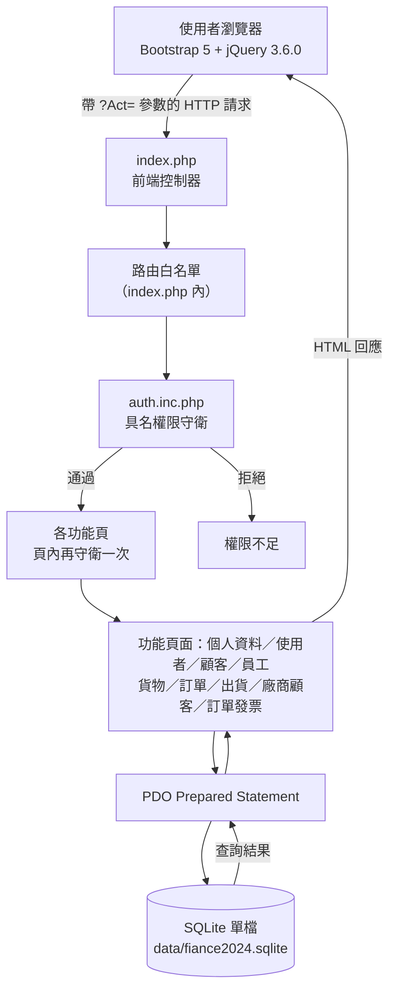
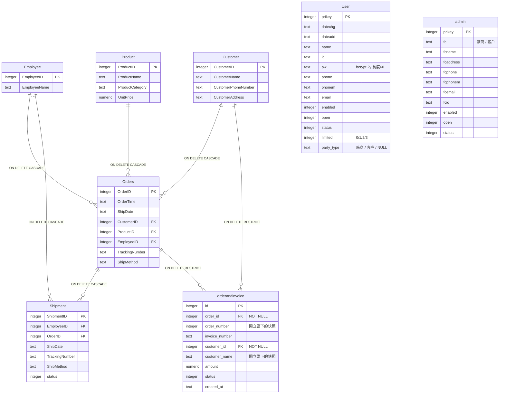

# Enterprise Operations Management System

以 PHP 8 + SQLite 打造的企業日常作業管理系統示範專案。涵蓋員工、顧客、產品、訂單、
出貨、訂單發票與廠商顧客關係的增刪修查。整個資料庫是**單一 SQLite 檔案**，沒有資料庫
伺服器、沒有帳號密碼要設定，`docker compose up -d` 一道指令即可在本機跑起來。

- **前端**：Bootstrap 5、jQuery 3.6.0（皆為套件檔，樣式內嵌於各頁）
- **後端**：PHP 8（無框架、無 Composer、無建置步驟）
- **資料庫**：SQLite，單檔存於 `data/fiance2024.sqlite`
- **容器**：`php:8-apache`
- **驗證**：`scripts/smoke.sh`，20 項可重跑的檢查，任一失敗即以非 0 結束碼退出

---

## 功能一覽

| 模組 | 動作 |
|---|---|
| 個人資料 | 檢視、編輯、刪除 |
| 使用者管理 | 列表、新增、編輯、刪除、批量刪除 |
| 顧客 | 列表、新增、編輯、刪除、批量刪除 |
| 員工 | 列表、新增、編輯、刪除、批量刪除 |
| 貨物（產品） | 列表、新增、編輯、刪除、批量刪除 |
| 訂單 | 列表、新增、編輯、刪除 |
| 出貨 | 列表、新增、編輯、刪除、批量刪除 |
| 廠商顧客關係 | 列表、新增、編輯、刪除（軟刪除 `enabled=0`） |
| 訂單發票 | 列表、新增、編輯、刪除、批量刪除 |
| 帳號 | 註冊（可選擇廠商或顧客身分）、登入、登出 |

---

## 系統架構

所有請求都經過單一前端控制器 `index.php`，由網址參數 `?Act=<數字>` 決定 `include`
哪一頁。權限有三層把關：`index.php` 的路由白名單 → `auth.inc.php` 的具名守衛 →
每一頁自己頁內再檢查一次。資料存取一律走 PDO prepared statement。



### 頁面路由（`index.php` 的 `Act` 參數）

| 模組 | 列表 | 新增 | 編輯 | 刪除 | 批量刪除 |
|---|---|---|---|---|---|
| 個人資料 | `100` | — | `105` | `115` | — |
| 使用者 | `110` | `140` | `120` | `130` | `135` |
| 廠商顧客 | `200` | `210` | `230` | `220` | — |
| 訂單發票 | `240` | `250` | `270` | `260` | `265` |
| 顧客 | `300` | `320` | `340` | `330` | `335` |
| 員工 | `350` | `360` | `380` | `370` | `375` |
| 貨物 | `390` | `400` | `420` | `410` | `415` |
| 訂單 | `430` | `440` | `460` | `450` | — |
| 出貨 | `470` | `480` | `490` | `500` | `510` |

其他：`150` 首頁、`160` 註冊。

---

## 資料庫結構

共 **8 張表**，其中 6 張以 **7 條外鍵**互相關聯，`User` 與 `admin` 兩張**刻意不設任何
外鍵**、與其他表沒有關聯。



### 7 條外鍵一覽

| 從 | 到 | ON DELETE |
|---|---|---|
| `Orders.CustomerID` | `Customer.CustomerID` | CASCADE |
| `Orders.ProductID` | `Product.ProductID` | CASCADE |
| `Orders.EmployeeID` | `Employee.EmployeeID` | CASCADE |
| `Shipment.OrderID` | `Orders.OrderID` | CASCADE |
| `Shipment.EmployeeID` | `Employee.EmployeeID` | CASCADE |
| `orderandinvoice.order_id` | `Orders.OrderID` | RESTRICT |
| `orderandinvoice.customer_id` | `Customer.CustomerID` | RESTRICT |

### 兩個值得注意的設計

- **`User` 與 `admin` 沒有外鍵**，也不與其他表關聯。`admin` 是廠商與顧客的主檔，
  不是使用者表——它沿用了 `User` 的部分欄位命名，但用途不同。
- **`orderandinvoice.order_number` 與 `customer_name` 是「開立當下的唯讀快照」**，
  不是冗餘欄位。設計意圖是：顧客日後改名，已開立的舊發票仍顯示開立當時的名稱。
  真正的關聯真相由 `order_id` / `customer_id` 兩個外鍵維持，且刪除行為是 `RESTRICT`
  ——不允許因刪除訂單或顧客而讓發票失去關聯。

外鍵約束在 SQLite 預設是關閉的，且必須每個連線各自開啟；本專案在每次建立 PDO 連線後
立即執行 `PRAGMA foreign_keys = ON`，否則 `ON DELETE CASCADE` 會靜默失效。

---

## 權限模型

角色以 `User.limited` 一個整數欄位表示，**不做大小比較**——新增角色時必須在
`auth.inc.php` 對應的允許清單中明確加入。

| `limited` | 角色 | 可存取範圍 |
|---|---|---|
| `0` | 未授權 | 無（註冊後預設，或被停用） |
| `1` | 管理員 | 全部，含使用者管理 |
| `2` | 內部員工 | 個人資料 ＋ 全部營運資料 |
| `3` | 外部使用者（廠商或顧客） | 僅個人資料 |

`auth.inc.php` 提供的具名守衛：

| 函式 | 通過條件 |
|---|---|
| `is_logged_in()` | `limited` 已設定（已登入） |
| `is_admin()` / `can_manage_users()` | `limited == 1` |
| `can_view_business_data()` | `limited` 為 `1` 或 `2` |
| `can_access_self()` | `limited` 為 `1`、`2` 或 `3` |

密碼以 PHP 內建 `password_hash()`（bcrypt，`$2y$` 開頭、長度 60）儲存。
外部使用者於註冊時選擇 `party_type`（廠商或客戶），註冊後 `limited` 一律為 `3`。

---

## 快速開始（Docker，一道指令）

前置需求：Docker Desktop。

```bash
git clone <this repo>
cd Enterprise-Operations-Management-System
docker compose up -d
```

容器啟動時會自動從範例檔複製 `config.inc.php`、並執行一次 `create.php`，所以應用程式
一開起來就有種子資料。

- 應用程式：<http://localhost:8080/login.php> — 以 **`Admin`** / **`123456`** 登入
- 隨時重建資料庫：開啟 <http://localhost:8080/create.php>

`create.php` 可重複執行：每次執行都會刪掉舊的資料庫檔、重新建表與塞種子資料。

### 不使用 Docker

需要有 `pdo_sqlite` 擴充的 PHP 8（預設內建）：

```bash
cp config.inc.php.example config.inc.php
php -S localhost:8080          # 然後開一次 http://localhost:8080/create.php
```

---

## 如何驗證它是對的

專案內建一支可重跑的驗證腳本，涵蓋 **20 項檢查**；任一項失敗會以非 0 結束碼退出。

```bash
docker compose exec web bash scripts/smoke.sh
```

檢查內容分為四類：

**資料庫結構與種子資料**

1. 資料表剛好 8 張
2. 每張表的種子筆數符合預期（`User` 11、其餘見腳本）
3. `PRAGMA foreign_keys` 為 `1`（外鍵約束已啟用）
4. `ON DELETE CASCADE` 實際會級聯：新增顧客與其訂單、刪除顧客後訂單同步消失（全程在交易內、結束即 rollback）
5. 時區：PHP 與 SQLite 的本地時間一致，本地與 UTC 相差 8 小時
6. 清空 `orderandinvoice` 後下一個自增號回到 `1`
8. 每一筆發票都有 `order_id` / `customer_id` 外鍵，且 `order_number` / `customer_name` 快照非空

**登入與密碼**

- 7a. 以 `Admin` / `123456` 可登入，取得 `PHPSESSID`，頁面出現「歡迎」
- 7b. 密碼錯誤會被拒絕，頁面出現「帳號或密碼」錯誤且不出現「歡迎」
- 9. `Admin` 的密碼雜湊為 `$2y$` 開頭、長度 60

**權限與直接存取**

- `AUTH-GUARDS`：45 個功能檔全部使用指定的具名權限守衛
- `EXTERNAL-REGISTER`：外部使用者註冊後 `limited=3`、`party_type=廠商`
- `EXTERNAL-LOGIN`：外部使用者可登入並取得 `PHPSESSID`
- `EXTERNAL-VISIBILITY`：外部使用者只看得到個人資料頁；`Act=300/200/240` 均顯示「權限不足!」
- `DIRECT-ACCESS`：列舉 web root 下所有非例外的 `.php`，未登入直接開啟都顯示「權限不足!」且不含任何應用程式內容
- `EXTERNAL-DIRECT-ACCESS`：`limited=3` 直接開 `ProductEdit.php` 仍被擋下

**注入防護、路由與衛生**

- 10. SQL injection 探針：送出含 `'); DROP TABLE admin;--` 的欄位值，字串原樣保存、`admin` 表完好（測試新增的資料結束時移除）
- `ROUTES`：18 個指定的 `Act` 路由皆回應 2xx/3xx，且不含 PHP 錯誤
- 11. Apache 錯誤輸出沒有 `Deprecated` / `Warning` / `Fatal`
- 12. Git 已追蹤的檔案不含 `*.sqlite`、`sess_*`、`config.inc.php`、`*.mp3`

> 已知限制：檢查 10 需要先登入，所以 7a 一旦失敗，10 會連帶誤報。看到 10 紅時先確認 7a 是否也紅了。

---

## 授權與素材

本 repo 不含任何第三方圖片、圖示或音訊素材。
